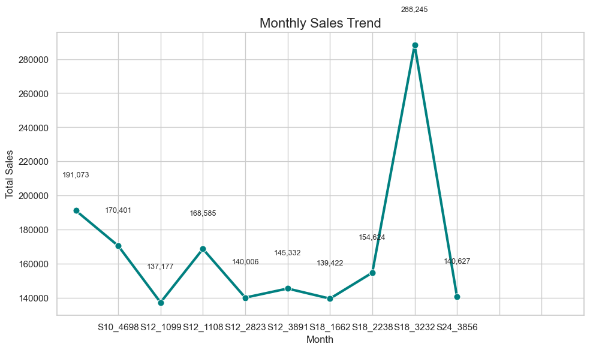
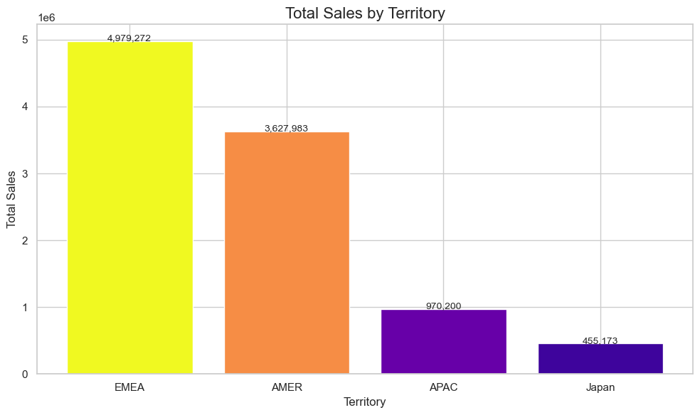

# Retail Sales Analysis

## Project Overview
This project analyzes retail sales data to uncover key trends, top-selling products, seasonal patterns, and regional performance. The goal is to provide actionable insights to guide inventory management, marketing strategies, and business growth decisions.

## Dataset
- **Source:** Kaggle – Retail Sales Data  
- **Contents:** Product sales, order dates, customer locations, territories, and other relevant details.  

## Goals
1. Identify top-selling products.  
2. Analyze monthly and seasonal sales trends.  
3. Evaluate territory-wise performance.  
4. Provide actionable business recommendations.

## Key Findings
- **Top Products:** Top 10 products identified by total sales.  
- **Monthly Trends:** Seasonal peaks observed for certain months.  
- **Territories:**  
  - **EMEA:** ₹4.97M (highest)  
  - **AMER:** ₹3.63M  
  - **APAC & Japan:** Smaller contributors, potential for growth  

## Visualizations
- Bar chart of top-selling products  
- Line chart of monthly sales trend  
- Heatmap of monthly sales by territory  

**Screenshots:**  
  
  
  

*(To add screenshots, create a folder named `images` in your repo and upload your chart images there.)*

## Business Recommendations
- Focus marketing on **EMEA and AMER** during peak months.  
- Explore growth opportunities in **APAC and Japan**.  
- Stock top-selling products ahead of high-demand periods.  

## Next Steps
- Analyze **year-over-year trends**.  
- Build **predictive sales models**.  
- Incorporate **customer segmentation** to improve targeting.

## Technologies
- Python 3  
- Pandas, NumPy, Matplotlib, Seaborn  
- Jupyter Notebook  

## Author
Lavanya Vanga
